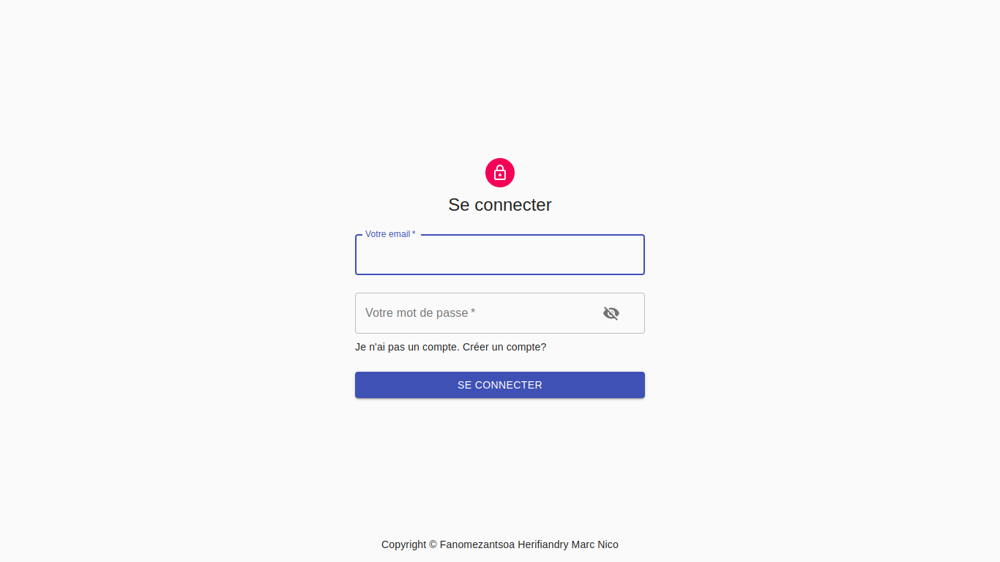

## Application gestion des matériels coté client

### 🚀 React / Express / Mongoose / Apollo client 3 🚀

- Install these program in your PC
  - Node.js
  - `npm install create-react-app` (if you don't have installed)

---

- Open a terminal inside the project folder :

  - Install all fontend's packages : `cd client` + `npm install`

    - then start fontend : `npm start`

---

### Client config :

- Create a `.env` file indide the client folder within the server URL :
  - REACT_APP_API_URL=http://localhost:8000/ `your server url`

💻 Made by Fanomezantsoa Herifiandry Marc Nico, 12 novembre 2021 at 14h 34min. Free to use

Email: ny.kalash@gmail.com

Facebook: Ks Krimi

site web: ks-krimi.github.io

Tel: 032 40 519 20 / 034 82 419 97
